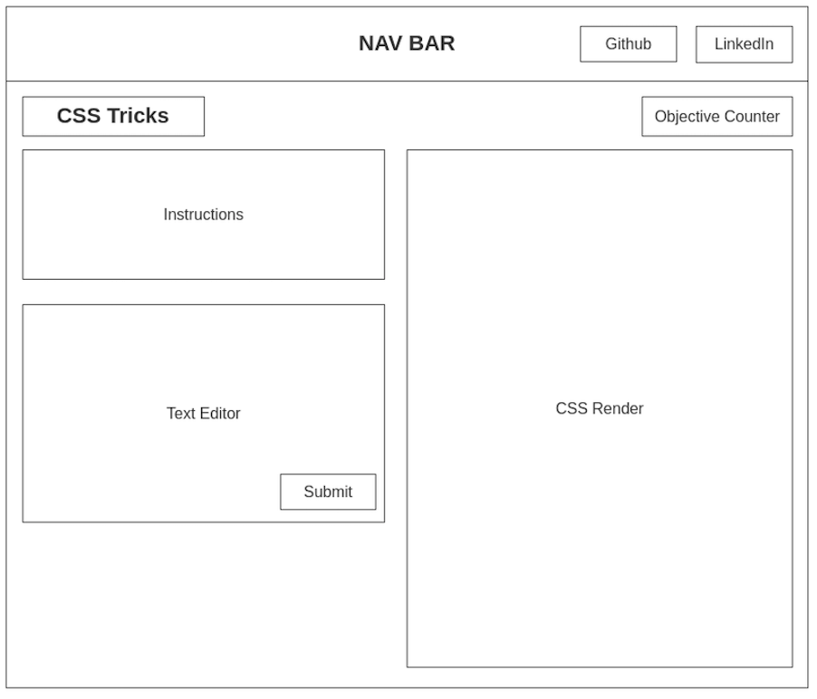

# **CSS Tricks**
CSS Tricks is a game inspired by Flexbox Froggy where players will interact 
with a text editor to complete a CSS trick. As they progress through the game 
the tricks become harder and more involved. The player wins when all of the 
objectives have been completed. 

## **Functionality & MVP List**
1. Text Editor feature 
2. A render of the CSS 
3. Page Counter to keep track of the completed levels
4. Production README.md

## **Wireframe**
CSS Tricks will consist of a single page with a text editor, css render box, 
instructions, and a counter to display how many objectives the user has 
completed. The user will type code into the text editor to manipulate the 
objects in the css render. 

## **Technologies**
* `HTML`
* `CSS`
* `Javascript`
